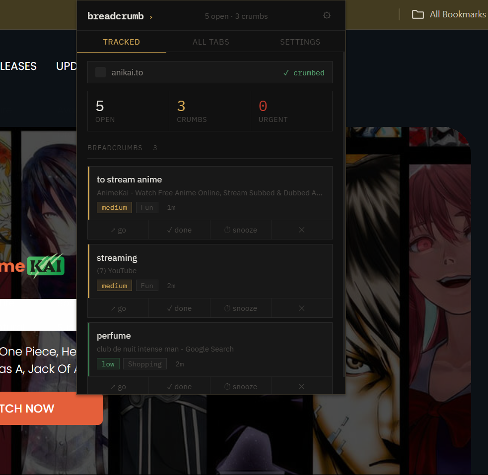
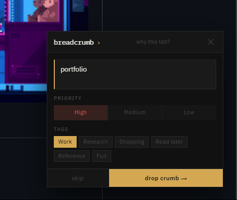

# Breadcrumb ›

<div align="center">

### A minimal Chrome extension that remembers why you opened every tab

[](https://github.com)
[](https://developer.chrome.com/docs/extensions/mv3/)
[](LICENSE)
[](https://developer.mozilla.org/en-US/docs/Web/JavaScript)
[](package.json)

[Install Extension](#-installation) · [See How It Works](#-how-it-works) · [Report Bug](../../issues) · [Request Feature](../../issues)

</div>

---

## 📸 Screenshots

<div align="center">

<!-- Replace these filenames with your actual screenshot filenames after uploading to /images -->

&nbsp;&nbsp;&nbsp;&nbsp;


*Left: Tracked tab overview &nbsp;·&nbsp; Right: Drop-a-crumb overlay on a new tab*

</div>

---

## 📋 Table of Contents

- [The Problem](#-the-problem)
- [Features](#-features)
- [How It Works](#-how-it-works)
- [Installation](#-installation)
- [Project Structure](#-project-structure)
- [Permissions](#-permissions)
- [Tech](#️-tech)
- [Privacy](#-privacy)
- [Publishing](#-publishing-to-chrome-web-store)
- [Contributing](#-contributing)
- [License](#-license)
- [Contact](#-contact)

---

## 😤 The Problem

You open a tab with a purpose. Then you open seven more. By the time you come back, you've forgotten what you were doing — and that tab sits there forever, one of twenty ghosts you're too afraid to close.

**Breadcrumb solves this with one question:** *why did you open this?*

---

## ✨ Features

<table>
<tr>
<td width="50%">

### 🎯 Core Features
- 🍞 **Auto-prompt** on every new tab
- 📌 **Reasons + tags + priority** per tab
- ⏰ **Reminders** at 15m / 30m / 1h / tomorrow
- 😴 **Snooze** — push the reminder back
- ✓ **Done** — marks complete and closes the tab

</td>
<td width="50%">

### 🛠️ Built Right
- 🔒 **100% local** — no servers, no accounts
- 🚫 **Zero inline handlers** — fully CSP-compliant
- ⚡ **No build step** — pure Manifest V3
- 📦 **No dependencies** — vanilla JS only
- 🌑 **Dark theme** — easy on the eyes

</td>
</tr>
</table>

---

## 🔄 How It Works

```
open new tab
      │
      ▼
 "why this tab?" overlay appears
      │
      ▼
 type a reason → pick priority → set reminder time
      │
      ▼
 crumb saved locally in chrome.storage
      │
      ▼
 alarm fires at your chosen time
      │
      ▼
 notification: "did you finish: 'compare prices before buying'?"
      │
      ├──  ✓ done   →  tab closes, crumb removed
      └──  snooze   →  reminded again in 15 min
```

### Priority system

| Indicator | Priority | When to use |
|-----------|----------|-------------|
| 🔴 Red stripe | High | Need this before end of day |
| 🟡 Amber stripe | Medium | Getting to it soon |
| 🟢 Green stripe | Low | Nice to have, no rush |

---

## 🚀 Installation

### Load unpacked (Developer Mode)

**1️⃣ Download the extension**
```bash
git clone https://github.com/yourusername/breadcrumb.git
```
> Or download `breadcrumb-extension.zip` from [Releases](../../releases) and unzip it

**2️⃣ Open Chrome extensions**
```
chrome://extensions
```

**3️⃣ Enable Developer Mode**

Toggle the switch in the top-right corner of the extensions page

**4️⃣ Load the folder**

Click **Load unpacked** → select the `breadcrumb-extension` folder

**5️⃣ Done**

The `›` icon appears in your toolbar. Open any new tab and Breadcrumb will ask why. 🎉

---

## 📂 Project Structure

```
breadcrumb-extension/
│
├── 📄 manifest.json           # Manifest V3 config
│
├── 📁 icons/                  # Extension icons
│   ├── icon16.png             # Toolbar icon
│   ├── icon48.png             # Extensions page icon
│   └── icon128.png            # Chrome Web Store icon
│
└── 📁 src/
    ├── background.js          # Service worker — tab lifecycle, alarms, notifications
    ├── content.js             # Injected overlay prompt on new tabs
    ├── popup.html             # Extension popup UI (IBM Plex, dark theme)
    ├── popup.js               # Popup logic — CSP-safe, event delegation only
    └── options.html           # Options page
```

---

## 🔐 Permissions

| Permission | Why it's needed |
|---|---|
| `tabs` | Read tab URLs, titles, and favicons |
| `storage` | Save crumbs and settings locally on your device |
| `alarms` | Schedule reminder notifications |
| `notifications` | Show reminder popups with action buttons |
| `scripting` | Inject the prompt overlay into new tabs |
| `activeTab` | Access the currently active tab from the popup |

> No data ever leaves your device. These permissions are the minimum required.

---

## 🛠️ Tech

<div align="center">


</div>

| Layer | Choice | Why |
|---|---|---|
| **Language** | Vanilla JS (ES2020) | No build step, instant load |
| **Extension API** | Manifest V3 | Current standard, service workers |
| **Storage** | `chrome.storage.local` | Local-only, persistent across sessions |
| **Reminders** | `chrome.alarms` | Survives browser restarts |
| **Notifications** | `chrome.notifications` | Native action buttons (Done / Snooze) |
| **Typography** | IBM Plex Sans + Mono | Crisp, readable, developer aesthetic |
| **Event handling** | `addEventListener` + delegation | Fully CSP-compliant, no inline handlers |

---

## 🔒 Privacy

- ✅ All data stored locally via `chrome.storage.local`
- ✅ No external network requests of any kind
- ✅ No analytics or telemetry
- ✅ No accounts or sign-in required
- ✅ Uninstalling removes all data automatically

---

## 📦 Publishing to Chrome Web Store

**1️⃣ Zip the extension**
```bash
zip -r breadcrumb.zip breadcrumb-extension/
```

**2️⃣ Go to the Developer Dashboard**

[chrome.google.com/webstore/devconsole](https://chrome.google.com/webstore/devconsole)

**3️⃣ Upload**

Click **New Item** → upload `breadcrumb.zip`

**4️⃣ Fill in the listing**

Add a name, description, category (Productivity), and screenshots

**5️⃣ Submit**

Review typically takes 1–3 business days. One-time $5 developer fee if not already registered.

---

## 🤝 Contributing

Contributions, issues, and feature requests are welcome!

<div align="center">

[](../../issues)
[](../../pulls)
[](../../network/members)

</div>

**1️⃣ Fork the repository**

**2️⃣ Create your feature branch**
```bash
git checkout -b feature/your-feature-name
```

**3️⃣ Commit your changes**
```bash
git commit -m "add: your feature description"
```

**4️⃣ Push to the branch**
```bash
git push origin feature/your-feature-name
```

**5️⃣ Open a Pull Request** 🎉

### Good first issues

- Adding keyboard shortcuts to the prompt overlay
- Supporting Firefox (WebExtensions API)
- Tag suggestions based on URL hostname patterns
- Export / import all crumbs as JSON

---

## 📄 License

This project is licensed under the **MIT License** — see the [LICENSE](LICENSE) file for details.

```
MIT License — Copyright (c) 2024

Permission is hereby granted, free of charge, to any person obtaining a copy
of this software to deal in the Software without restriction, including the
rights to use, copy, modify, merge, publish, distribute, sublicense, and/or
sell copies of the Software.
```

---

## 📧 Contact

<div align="center">

### Let's connect 🤝

<!-- Replace these with your actual profile links -->
[](https://devrac.vercel.app/)
[](https://github.com/Devatva24)
[](https://linkedin.com/in/devatva-rachit-317a11229)
[](https://x.com/DevatvaR)
[](mailto:rachitdevatva722448@gmail.com)

</div>

---

<div align="center">

### If Breadcrumb saved you from tab chaos, give it a ⭐️

**built to fix the too-many-tabs problem, once and for all**

*vanilla js &nbsp;·&nbsp; manifest v3 &nbsp;·&nbsp; zero dependencies &nbsp;·&nbsp; fully local*

</div>
